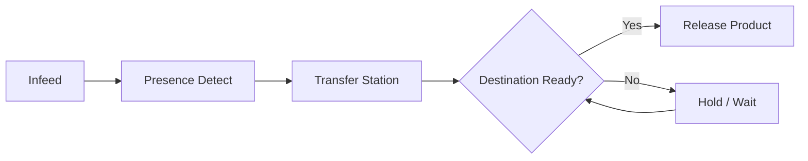

# Conveyors & Material Handling

Document conveyor sections, transfer stations, lifts, sensors, interlocks and routing logic here.

## Key Controls

- Product presence sensors
- Stop positions
- Transfer confirmation
- Lift up/down permissives
- Jam detection
- Emergency stop behavior
- PLC/MES handshake
- Manual recovery method

## Flow Example

