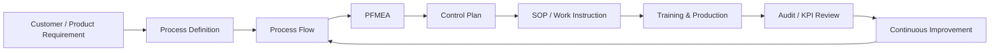

# Manufacturing Engineering Knowledge Base

Welcome to the central documentation site for manufacturing engineering, NPI, equipment, server platforms, process controls, and continuous improvement.

!!! info "Purpose"
    Use this site as the single source of truth for engineering standards, process documentation, lessons learned, and reusable templates.

## Quick Access

| Area | Use It For |
|---|---|
| [Process Engineering](process-engineering/index.md) | Process flows, PFMEA, control plans, SOPs and work instructions |
| [NPI](npi/index.md) | New product readiness, launch checklists and lessons learned |
| [Equipment](equipment/index.md) | Testers, conveyors, fixtures, ASRS and equipment notes |
| [Server Platforms](server-platforms/index.md) | Product-specific engineering information |
| [Forms & Templates](templates/index.md) | Standardized engineering forms and repeatable documentation |

## Documentation Standards

1. Keep page titles specific and searchable.
2. Add an owner and last-review date to controlled process pages.
3. Link related PFMEA, control plan, SOP and process-flow documents.
4. Capture process changes and lessons learned as they occur.
5. Avoid duplicate versions of the same controlled information.

## Engineering Documentation Flow

## Current Focus

- [ ] Standardize process-flow documentation
- [ ] Establish PFMEA and control-plan ownership
- [ ] Build NPI launch-readiness discipline
- [ ] Centralize equipment troubleshooting knowledge
- [ ] Capture lessons learned by product/platform
