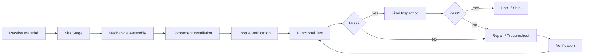

# Process Flows

**Owner:** Process Engineering  
**Review frequency:** At NPI launch and after major process changes

## Standard Flow Rules

- Normal production flow should read left-to-right.
- Pass paths continue forward.
- Fail paths move downward to inspection, rework or reject.
- Rework loops return to the correct validated point in the process.
- MES transactions should be shown where product status or routing changes.

## Example Server Assembly Flow

## Required Information

A controlled process flow should identify:

- Process/station number
- Station name
- Input and output
- Inspection or decision points
- Pass/fail routing
- Rework/repair loops
- MES/system transactions
- Special process controls
- Responsible function where needed
